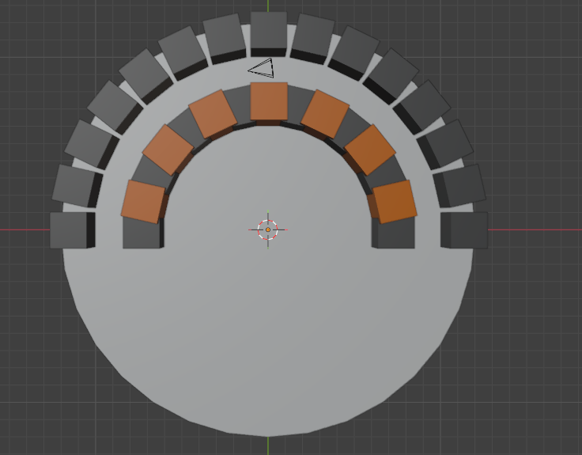
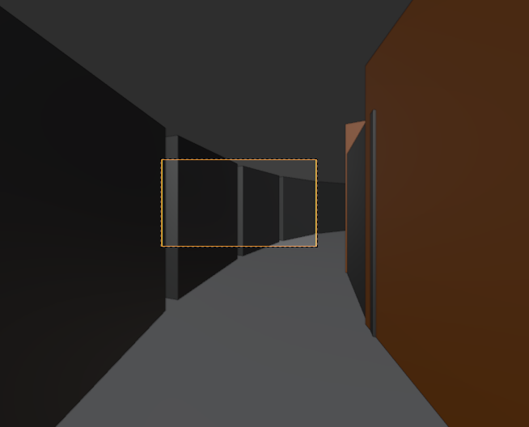

# Documentación del Proyecto Integrador: Escenario Animado en Blender

Este documento explica en detalle el funcionamiento del script de Python para Blender (`proyecto_integrador.py`), el cual genera de forma procedural un escenario en forma de semicírculo y crea una animación automática del recorrido de una cámara a través del mismo.

## 1. Introducción
El script utiliza la API de Python de Blender (`bpy`) y la librería matemática estándar (`math`) para calcular rotaciones, posiciones y generar elementos 3D en la escena. El resultado es un pasillo curvo (semicircular) delimitado por dos paredes de bloques, con un patrón visual en la pared interior y un sistema de riel virtual por donde viaja la cámara.

## 2. Código Fuente

```python
import bpy
import math

def crear_material(nombre, color_rgb):
    # Implementación del modelo de color RGB [cite: 10]
    mat = bpy.data.materials.new(name=nombre)
    mat.diffuse_color = (*color_rgb, 1.0)
    return mat

def generar_escenario_animado():
    # 1. Limpieza del entorno [cite: 3, 6]
    bpy.ops.object.select_all(action='SELECT')
    bpy.ops.object.delete()

    # 2. Definición de Materiales [cite: 9, 19]
    mat_pared_a = crear_material("ParedOscura", (0.1, 0.1, 0.1))
    mat_pared_b = crear_material("ParedDetalle", (0.8, 0.2, 0.0))

    # 3. Parámetros del Semicírculo
    cantidad_bloques = 15
    radio_interno = 7
    radio_externo = 11
    radio_central = (radio_interno + radio_externo) / 2 # Carril por donde pasará la cámara
    angulo_total = math.pi # 180 grados

    # 4. Construcción Procedural (Transformaciones de Traslación y Escalamiento) [cite: 22, 34]
    for i in range(cantidad_bloques):
        angulo = (i / (cantidad_bloques - 1)) * angulo_total
        
        # Posiciones mediante trigonometría
        for r, material, es_detalle in [(radio_interno, mat_pared_a, False), (radio_externo, mat_pared_a, True)]:
            x = math.cos(angulo) * r
            y = math.sin(angulo) * r
            
            bpy.ops.mesh.primitive_cube_add(location=(x, y, 1))
            bloque = bpy.context.active_object
            bloque.rotation_euler.z = angulo + math.pi/2
            
            # Lógica de color alternada para la pared "izquierda" (interna) [cite: 23, 30]
            if r == radio_interno:
                if i % 2 == 0:
                    bloque.data.materials.append(mat_pared_a)
                else:
                    bloque.data.materials.append(mat_pared_b)
                    bloque.scale.z = 1.5 # Escalamiento visual [cite: 34]
            else:
                bloque.data.materials.append(mat_pared_a)

    # 5. Suelo (Cilindro escalado para cubrir el arco) [cite: 37, 46]
    bpy.ops.mesh.primitive_cylinder_add(radius=radio_externo + 1, depth=0.1, location=(0,0,0))

    # --- ANIMACIÓN DE RECORRIDO INTERIOR ---
    bpy.ops.object.camera_add()
    camara = bpy.context.active_object
    bpy.context.scene.camera = camara

    frames_totales = 120
    bpy.context.scene.frame_end = frames_totales

    for f in range(frames_totales + 1):
        t = f / frames_totales
        angulo_cam = t * angulo_total # Recorrido completo de 0 a PI
        
        # Posicionamiento en el carril central
        camara.location.x = math.cos(angulo_cam) * radio_central
        camara.location.y = math.sin(angulo_cam) * radio_central
        camara.location.z = 1.2 # Altura de los ojos
        
        # Rotación para que la cámara siempre mire "hacia adelante" en la curva
        camara.rotation_euler.x = math.radians(90) 
        camara.rotation_euler.z = angulo_cam + math.pi/2 + math.radians(90)
        
        # Insertar Keyframes de animación
        camara.keyframe_insert(data_path="location", frame=f)
        camara.keyframe_insert(data_path="rotation_euler", frame=f)

generar_escenario_animado()
```

## 3. Análisis del Código Paso a Paso

### 3.1. Funciones Auxiliares: Creación de Materiales
```python
def crear_material(nombre, color_rgb):
    mat = bpy.data.materials.new(name=nombre)
    mat.diffuse_color = (*color_rgb, 1.0)
    return mat
```
Esta función simplifica la creación de materiales en Blender. Recibe un nombre y una tupla RGB. El valor `1.0` al final corresponde al canal Alfa (opacidad total o sin transparencia).

### 2.2. Función Principal: `generar_escenario_animado()`
Esta es la rutina principal que construye todo el entorno de un solo golpe. Se divide en las siguientes fases lógicas:

#### A. Limpieza del entorno
```python
bpy.ops.object.select_all(action='SELECT')
bpy.ops.object.delete()
```
Antes de generar el escenario, el script selecciona y elimina todos los objetos preexistentes en la escena (el cubo por defecto, cámara, luces, etc.). Esto asegura un lienzo en blanco para que, si el script se ejecuta múltiples veces, no se acciden o amontonen elementos.

#### B. Definición de Materiales
Se crean dos materiales principales:
- **ParedOscura:** Un color gris oscuro `(0.1, 0.1, 0.1)`.
- **ParedDetalle:** Un tono marrón/naranja `(0.8, 0.2, 0.0)`.

#### C. Parámetros del Semicírculo
Se definen las constantes matemáticas que conforman la estructura del proyecto:
- `cantidad_bloques`: 15 pilares o cubos por cada una de las dos paredes.
- `radio_interno` (7) y `radio_externo` (11): Determinan qué tan amplio es el pasillo por donde se caminará. 
- `radio_central`: Es exactamente el punto medio de ambos radios (9). Funciona como el "riel" invisible por donde la cámara pasará sin chocar ni a la izquierda ni a la derecha.
- `angulo_total`: Equivale a `math.pi` (180 grados), lo que da como resultado un semicírculo perfecto.

#### D. Construcción Procedural mediante Trigonometría
El bloque de código principal comprende un bucle iterativo que da forma al semicírculo.
```python
x = math.cos(angulo) * r
y = math.sin(angulo) * r
```
Se aplica **trigonometría básica (coordenadas polares a cartesianas)**:
- La posición `x` se obtiene con la función coseno multiplicada por el radio.
- La posición `y` se obtiene con la función seno multiplicada por el radio.

Para cada grado del ángulo, se instancian dos bloques primitivos (`primitive_cube_add`): uno en la pared interna y otro en la externa.
A cada bloque añadido, se le modifica la rotación para que siempre esté alineado y viendo hacia el centro de la escena:
`bloque.rotation_euler.z = angulo + math.pi/2`

**Lógica Condicional de Patrones Visuales:**
Para romper la monotonía del puente, el script altera la pared interna según si la iteración del bloque es par o impar (usando el operador módulo `%`):
- Si el bloque es **par** (`i % 2 == 0`): Se asigna el material _ParedOscura_.
- Si el bloque es **impar**: Se colorea de anaranjado (_ParedDetalle_) y utilizando `bloque.scale.z = 1.5` se altera su tamaño vertical para que actúe como una columna que resalta visualmente.
- La pared externa no posee este patrón, siendo en su totalidad de color oscuro.

#### E. Creación del Suelo
Se genera un disco añadiendo un cilindro (`primitive_cylinder_add`) en los ejes origen `(0,0,0)`. Se aplasta variando su valor de `depth=0.1` y se asegura que cubra la distancia completa de la calle curvada asignándole como radio `radio_externo + 1`.

#### F. Animación de Recorrido Interior (Keyframing Procedural)
En vez de animar a mano en la línea de tiempo de Blender, el script programa todo con matemáticas:
- **Duración:** Configura un total de 120 fotogramas automáticos con `frame_end = frames_totales`.
- **Interpolación temporal:** Entendiendo `t` (de 0 a 1) como el progreso de la animación en relación de los frames procesados `f` respecto a los subtotales. Multiplicándolo por el `angulo_total`, sabemos dónde debe ir la cámara numéricamente en dicho frame.
- **Ubicación (`location`):** Usa de nuevo _Seno_ y _Coseno_ con el `radio_central` (el pasillo seguro). Se levanta a `z = 1.2` para dar la ilusión de la perspectiva en primera persona.
- **Cálculo de Visión Continua (`rotation_euler`):** 
  - `x = math.radians(90)` ajusta la cámara para mirar perpendicular en el eje horizonte y no hacia el suelo de manera rotunda.
  - La rotación `z` se adapta con precisión guiada por `angulo_cam + math.pi/2 + math.radians(90)`. El objetivo es que vire suavemente apuntando hacia la carretera de manera paralela.
- Finalmente el script plasma la trayectoria mediante `keyframe_insert`, congelando los valores de traslación y rotación en cada foto.

### 3.7. Ajustes y Fragmentos Adicionales
Si deseas modificar el comportamiento del script, aquí hay algunas piezas de código que puedes reemplazar o integrar en la función principal:

**Circuito Cerrado (Anillo Completo):**
Para cambiar el escenario curvo a una arena circular completa (360 grados), simplemente cambia el ángulo total:
```python
# Reemplazar math.pi por tau (2*pi)
angulo_total = 2 * math.pi # 360 grados
cantidad_bloques = 30 # Doblar la cantidad de bloques para el anillo
```

**Generación de Cícones u Orbes en vez de Cubos:**
Puedes alterar la topología, cambiando el `primitive_cube_add` por otras primitivas de Blender dentro del bucle de construcción procedural:
```python
# En lugar de cubos
# bpy.ops.mesh.primitive_cube_add(location=(x, y, 1))

# Intentar esferas UV
bpy.ops.mesh.primitive_uv_sphere_add(radius=1, location=(x, y, 1))
```

---

## 4. Vistas del Proyecto

A continuación, se exhiben las imágenes generadas por el script:

### Vista Superior
Esta imagen ilustra la disposición estructural desde el cenit. Notará el piso completo en forma circular, la diferenciación del radio de la pared interna (derecha) versus la externa (izquierda), el giro perfecto a 180° y cómo se asoman las columnas naranjas interpoladas mediante escalamiento Z de la pared céntrica.



### Vista de Cámara (Recorrido Interno)
Visualiza el escenario desde los ojos del espectador animado. Destaca la perspectiva cónica que muestra la luz y la sombra en el pasillo interior, guiando el ojo a seguir la curvatura flanqueada por las estructuras repetitivas con saltos estéticos.



> **Importante:** Para que estas imágenes sean visibles correctamente localmente dentro del archivo Markdown, deberás guardar las fotos que enviaste con los nombres `vista_superior.png` y `vista_camara.png` en el mismo directorio donde coloques este documento Markdown.

---

## 4. Instrucciones de Ejecución
1. Abre un nuevo proyecto en **Blender** (idealmente versiones 3.0 o superior).
2. En las pestañas de desarrollo en la parte superior, navega al área de trabajo **Scripting**.
3. Da clic en **+ New** para abrir un nuevo cuadro de texto e íntegramente copia o carga el archivo fuente de Python proporcionado (`proyecto_integrador.py`).
4. Haz clic en el botón de **▶ Play (Run Script)** alojado en la cabecera del editor de texto.
5. Regresa al área **Layout** en primera instancia; verás el entorno listo.
6. Pulsa la  `Barra Espaciadora` sobre la zona de tiempo o escena (Timeline); verás tu cámara iniciar y finalizar el majestuoso recorrido semicircular programado.
